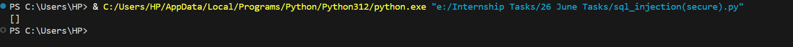
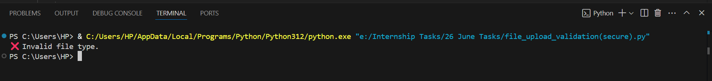
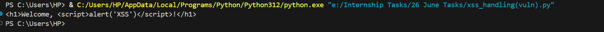
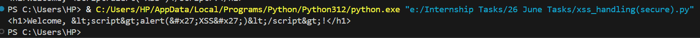
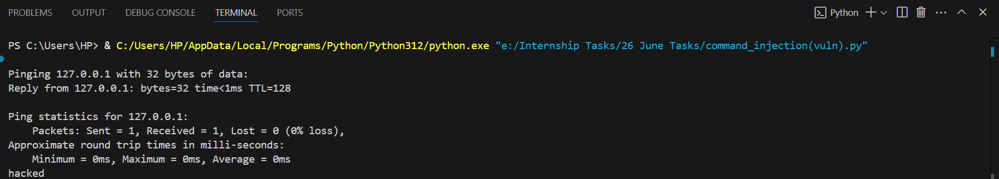
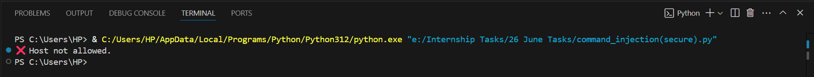

# 🔐 Secure Coding Practices: Fixing Common Vulnerabilities (OWASP-Aligned)
 
**Date:** 26 June 2025
**Name:** Samiksha Morshe  
**Task:** Secure Code Examples with OWASP Compliance

This document highlights insecure vs secure code practices for common web vulnerabilities using Python.  
Each fix is aligned with OWASP Top 10 standards and includes a brief explanation.

---

## 1. SQL Injection (OWASP A03 – Injection)

To test this vulnerability, a sample SQLite database was created using the following script:

📄 [`setup_db.py`](scripts/setup_db.py)

This sets up a local users.db database with one record: admin / admin@example.com.

### ❌ Vulnerable Script:  
📄 [`sql_injection(vuln).py`](scripts/sql_injection(vuln).py)

This script embeds unvalidated user input directly into a SQL query string, which leads to SQL Injection vulnerabilities.

### ✅ Secure Script:  
📄 [`sql_injection(secure).py`](scripts/sql_injection(secure).py)

This version uses parameterized queries to prevent SQL injection.

### 💻 Terminal Output

#### Vulnerable Version:

#### Secure Version:

### 🔍 Explanation:
The vulnerable version allows attackers to inject malicious SQL code because user input is directly embedded in the query string.  
The secure version uses **parameterized queries**, which safely separate SQL code from user input, preventing SQL Injection attacks (OWASP A03 – Injection).

### 🛠️ Issue Faced:
No issues occurred during testing. Both scripts were executed successfully. In the secure version, SQL Injection input returned an empty result as expected.

---

## 2. File Upload Validation (OWASP A05 – Security Misconfiguration)

### ❌ Vulnerable Script  
📄 [`file_upload_validation(vuln).py`](scripts/file_upload_validation(vuln).py)

Saves uploaded files without any validation, allowing potential execution of malicious scripts.

### ✅ Secure Script  
📄 [`file_upload_validation(secure).py`](scripts/file_upload_validation(secure).py)

Validates file extensions and MIME types before saving to prevent malicious file uploads.

### 💻 Terminal Output

#### Vulnerable Version:

#### Secure Version:

### 🔍 Explanation:
The vulnerable version accepts any file upload without validation, including `.php` files, which could be executed on a server and lead to Remote Code Execution.  
The secure version checks both the **file extension** and the **MIME type**, only allowing safe image uploads like `.jpg` and `.png`.

### 🛠️ Issue Faced:
Initially, the vulnerable script threw an error because the `uploads/` folder didn’t exist. The issue was fixed by creating the directory before writing the file.

---

## 3. Cross-Site Scripting (XSS) – OWASP A07

### ❌ Vulnerable Script  
📄 [`xss_handling(vuln).py`](scripts/xss_handling(vuln).py)

Outputs user input directly into HTML, which allows cross-site scripting (XSS) attacks.

### ✅ Secure Script  
📄 [`xss_handling(secure).py`](scripts/xss_handling(secure).py)

Escapes HTML special characters to prevent script injection in browser-rendered output.

### 💻 Terminal Output

#### Vulnerable Version:

#### Secure Version:

### 🔍 Explanation:
The vulnerable version outputs raw user input into an HTML context, which allows script tags to be executed by the browser — a classic Cross-Site Scripting (XSS) vulnerability.  
The secure version uses `html.escape()` to encode special characters like `<`, `>`, `'`, preventing script execution.

### 🛠️ Issue Faced:
No issues encountered — `html.escape()` worked as expected to neutralize unsafe input.

---

## 4. Command Execution (OWASP A03 – Injection)

#### ❌ Vulnerable Script  
📄 [`command_execution(vuln).py`](scripts/command_execution(vuln).py)

Uses os.system() with unsanitized input, allowing command injection on the system.

### ✅ Secure Script  
📄 [`command_execution(secure).py`](scripts/command_execution(secure).py)

Runs commands safely using subprocess.run() and a whitelist to block injections.

### 💻 Terminal Output

#### Vulnerable Version:

#### Secure Version:

🔍 Explanation:
The vulnerable version uses os.system() with direct user input, allowing command chaining (e.g., & echo hacked) which leads to command injection.
The secure version uses subprocess.run() without shell, and applies whitelisting to block untrusted input, making it resistant to injection.

🛠️ Issue Faced:
Initial script used Linux-specific -c ping flag, which caused an error on Windows. It was fixed by switching to -n for compatibility.

---

## ✅ Why These Fixes Are Better

- **Parameterized queries** in SQL prevent attackers from injecting malicious input as part of SQL logic, mitigating SQL Injection.
- **File validation** ensures only allowed file types (e.g., `.jpg`, `.png`) are uploaded, blocking dangerous files like `.php`.
- **HTML escaping** converts unsafe characters into harmless entities, preventing script execution in the browser (XSS).
- Using **`subprocess.run()` without shell access**, combined with input whitelisting, blocks arbitrary system command execution.

